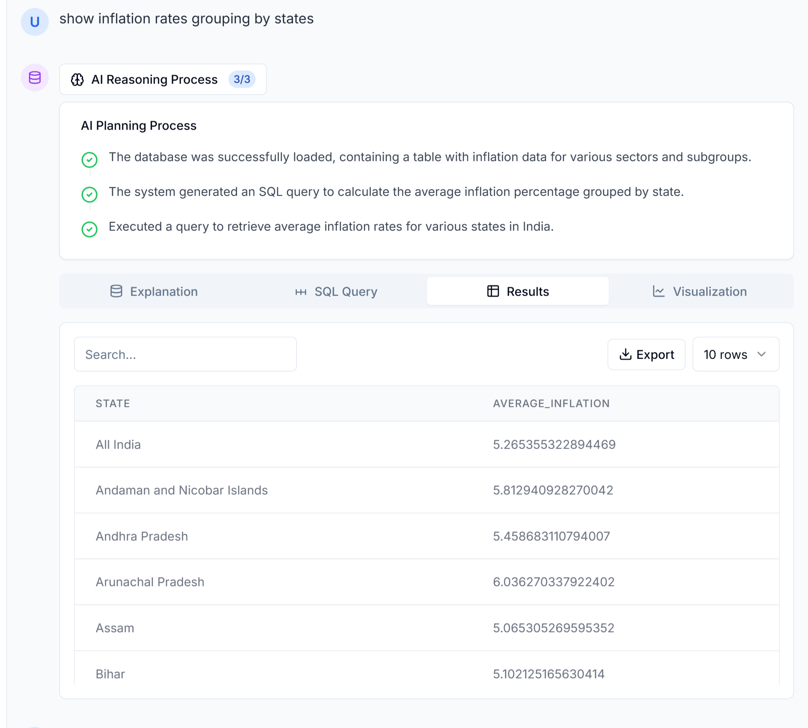
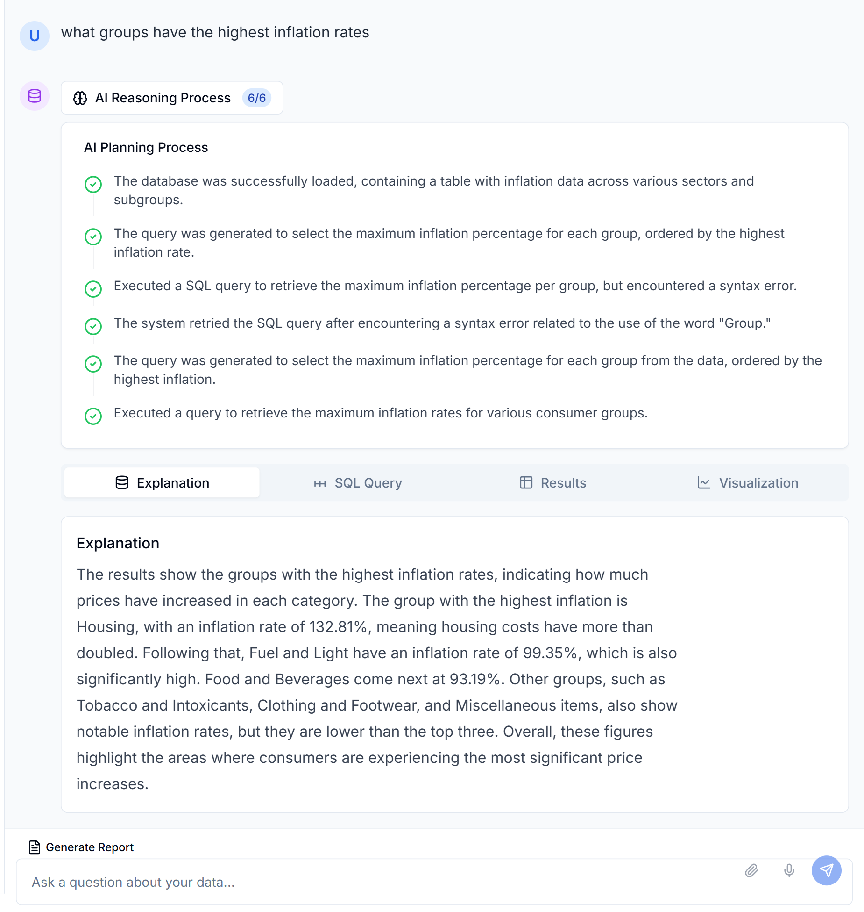
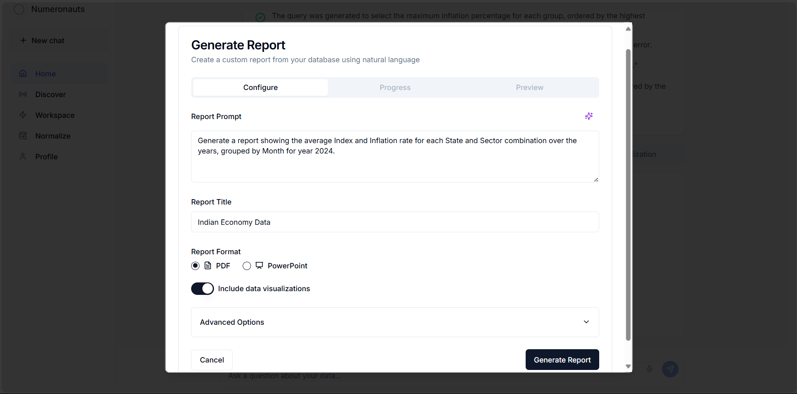
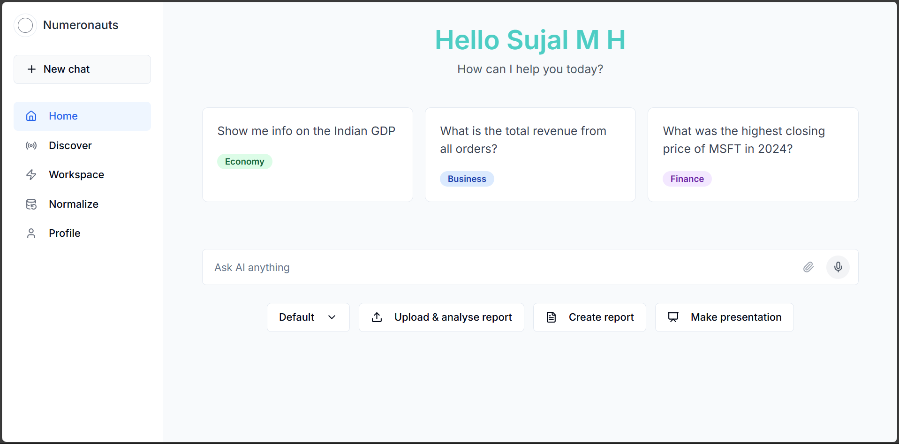
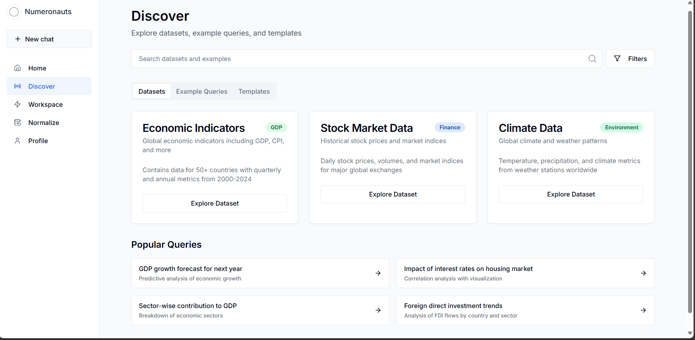
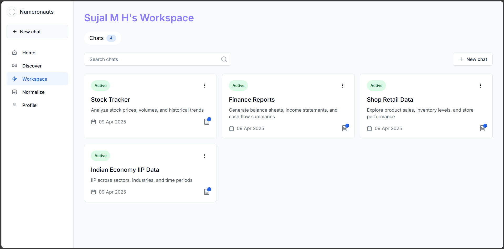
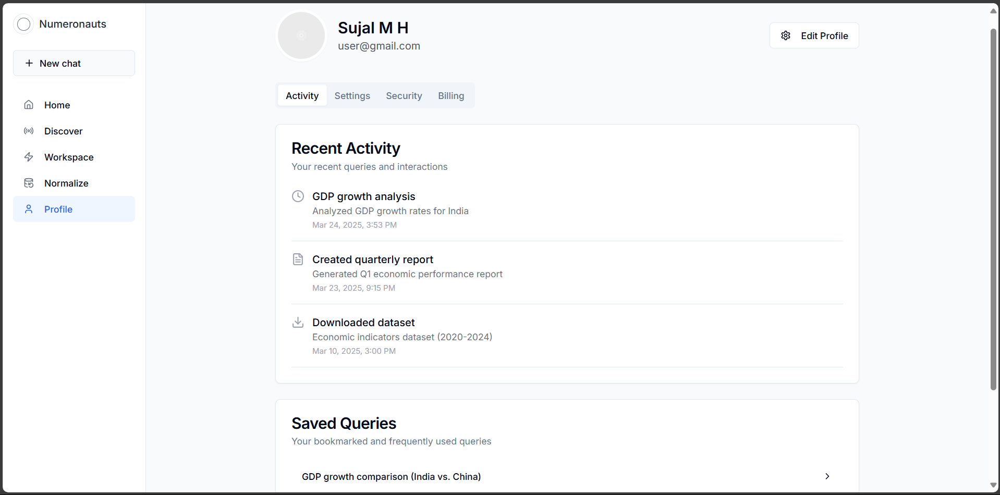
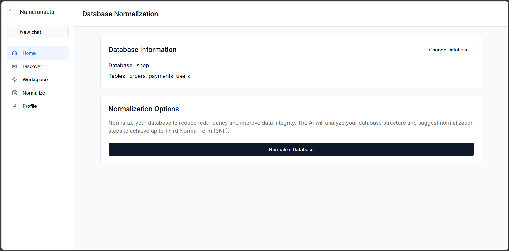
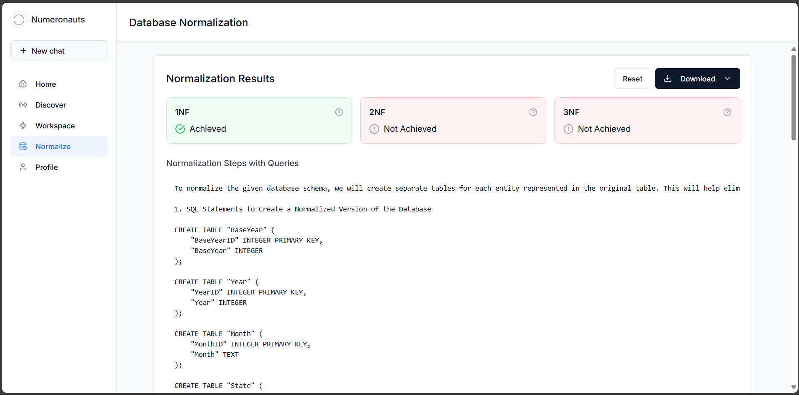

# 🧠 NL2SQL AI Assistant

A powerful AI-driven platform that converts **natural language (NL)** into **SQL queries**, executes them on structured data sources (JSON, CSV, MySQL, SQLite), and provides **rich visualizations** and **automated reports/presentations**. The system features **voice input**, an autonomous **AI agent**, and a clean **Next.js frontend** for seamless interaction.

---

## 🚀 Features

- 🗣️ **Natural Language to SQL Conversion**  
  Convert plain English questions into accurate SQL queries using LLMs and agents.

- 📊 **Auto Visualizations**  
  Generate bar, line, pie, or tabular visualizations based on SQL query results.

- 🧾 **PDF Report / Presentation Generation**  
  Export query results and visualizations as downloadable PDFs or slide decks.

- 🎙️ **Voice Input Support**  
  Interact with the assistant via voice commands for hands-free querying.

- 🧠 **AI Agent Framework**  
  Handles query generation, error retries, validation, and follow-up suggestions.

- 💾 **Multi-format Data Support**  
  Load data from:
  - JSON
  - CSV
  - SQLite
  - MySQL

- 🛠️ **Built-in Tools**
  - `Load DB`: Upload and manage structured datasets.
  - `Generate Query`: Automatically generate SQL from natural language.
  - `Load Query`: View, run, and edit previously generated queries.
  - `Retry on Error`: Automatic query rewriting if an error occurs.

---

## 🧑‍💻 Tech Stack

- **Frontend**: [Next.js](https://nextjs.org/)  
- **Backend**: FastAPI & Flask
- **Database Support**: MySQL, SQLite, CSV, JSON  
- **AI Stack**: OpenAI / Gemini (customizable), LangChain (Agentic execution)  
- **Visualization**: Plotly, Matplotlib, Seaborn  
- **PDF/PPT Export**: Python-PPTX
- **Voice Recognition**: Whisper

---

## 🧠 AI Agent Flow

1. **Receive NL input** (text/voice)
2. **Generate SQL** using an LLM
3. **Validate SQL** – retry on errors
4. **Run query** on selected DB
5. **Generate visualization** based on result type
6. **Export (optional)** as PDF/PPT
7. **Suggest follow-up questions**

---

## 📸 Screenshots

| Chat View                         | AI Chat Flow                       | Report Generation                  |
|----------------------------------|------------------------------------|------------------------------------|
|       |         |  |

| Home Page                         | Discover Datasets                  | Workspace                          |
|----------------------------------|------------------------------------|------------------------------------|
|         |       |      |

| User Profile                      | Normalized Tables - 1              | Normalized Tables - 2              |
|----------------------------------|------------------------------------|------------------------------------|
|      |    |    |
